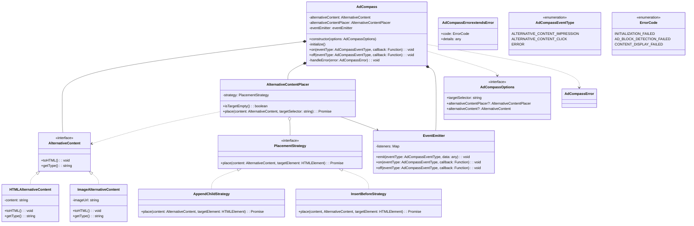

```mermaid
classDiagram
    class AdCompass {
        -alternativeContent: AlternativeContent
        -alternativeContentPlacer: AlternativeContentPlacer
        -eventEmitter: eventEmitter

        +constructor(options: AdCompassOptions)
        -initialize()

        +on(eventType: AdCompassEventType, callback: Function): void
        +off(eventType: AdCompassEventType, callback: Function): void

        -handleError(error: AdCompassError): void
    }

    class AdCompassOptions {
        <<interface>>
        +targetSelector: string
        +alternativeContentPlacer?: AlternativeContentPlacer
        +alternativeContent?: AlternativeContent
    }

    class AlternativeContent  {
        <<interface>>
        +toHTML(): void
        +getType(): string
    }

    class HTMLAlternativeContent {
        -content: string
        +toHTML(): void
        +getType(): string
    }

    class ImageAlternativeContent {
        -imageUrl: string
        +toHTML(): void
        +getType(): string
    }

    class EventEmitter {
        -listeners: Map<string, Function[]>
        +emit(eventType: AdCompassEventType, data: any): void
        +on(eventType: AdCompassEventType, callback: Function): void
        +off(eventType: AdCompassEventType, callback: Function): void
    }

    class AlternativeContentPlacer {
        -strategy: PlacementStrategy
        +isTargetEmpty(): boolean
        +place(content: AlternativeContent, targetSelector: string): Promise<HTMLElement>
    }

    class PlacementStrategy {
        <<interface>>
        +place(content: AlternativeContent, targetElement: HTMLElement): Promise<void>
    }

    class AppendChildStrategy {
        +place(content: AlternativeContent, targetElement: HTMLElement): Promise<void>
    }

    class InsertBeforeStrategy {
        +place(content, AlternativeContent, targetElement: HTMLElement): Promise<void>
    }

    class AdCompassError extends Error {
        +code: ErrorCode
        +details: any
    }

    AdCompass *-- AlternativeContent
    AdCompass *-- AlternativeContentPlacer
    AdCompass *-- EventEmitter
    AdCompass ..> AdCompassOptions
    AdCompass ..> AdCompassError

    AlternativeContentPlacer ..> AlternativeContent
    AlternativeContentPlacer o-- PlacementStrategy   
    AlternativeContentPlacer --> EventEmitter

    PlacementStrategy <|.. AppendChildStrategy
    PlacementStrategy <|.. InsertBeforeStrategy

    AlternativeContent <|.. HTMLAlternativeContent
    AlternativeContent <|.. ImageAlternativeContent

    class AdCompassEventType {
        <<enumeration>>
        ALTERNATIVE_CONTENT_IMPRESSION
        ALTERNATIVE_CONTENT_CLICK
        ERROR
    }

    class ErrorCode {
        <<enumeration>>
        INITIALIZATION_FAILED
        AD_BLOCK_DETECTION_FAILED
        CONTENT_DISPLAY_FAILED
    }
```