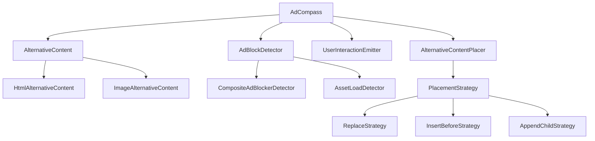

```mermaid
graph TD
    A[AdCompass] --> B[AlternativeContent]
    A --> C[AdBlockDetector]
    A --> E[UserInteractionEmitter]

    B --> J[HtmlAlternativeContent]
    B --> K[ImageAlternativeContent]

    A --> D[AlternativeContentPlacer]

    C --> F[CompositeAdBlockerDetector]
    C --> G[AssetLoadDetector]

    D --> I[PlacementStrategy]
    I --> M[ReplaceStrategy]
    I --> N[InsertBeforeStrategy]
    I --> O[AppendChildStrategy]
```