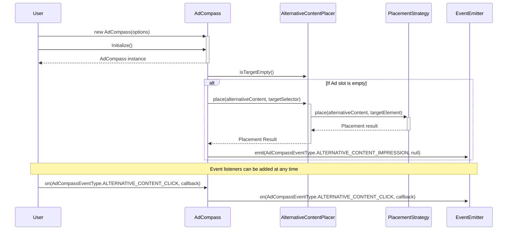

```mermaid
sequenceDiagram
    participant User as User
    participant AC as AdCompass
    participant ACP as AlternativeContentPlacer
    participant PS as PlacementStrategy
    participant EE as EventEmitter

    User->>+AC: new AdCompass(options)
    User->>AC: Initialize()
    AC-->>-User: AdCompass instance

    AC->>+ACP: isTargetEmpty()

    alt If Ad slot is empty
        AC->>+ACP: place(alternativeContent, targetSelector)
        ACP->>+PS: place(alternativeContent, targetElement)
        PS-->>-ACP: Placement result
        ACP-->>-AC: Placement Result
        AC->>+EE: emit(AdCompassEventType.ALTERNATIVE_CONTENT_IMPRESSION, null)
    end

    Note over User,EE: Event listeners can be added at any time

    User->>AC: on(AdCompassEventType.ALTERNATIVE_CONTENT_CLICK, callback)
    AC->>EE: on(AdCompassEventType.ALTERNATIVE_CONTENT_CLICK, callback)
```
