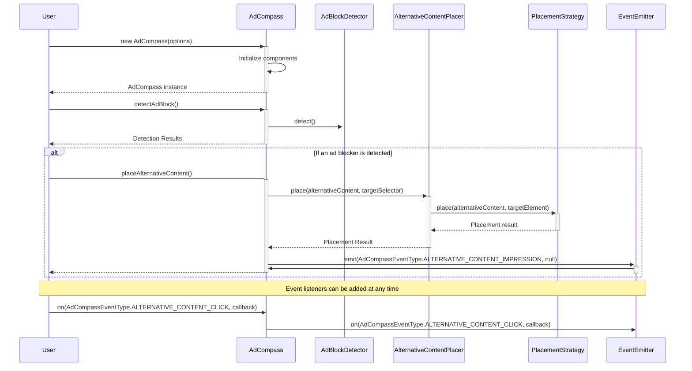

```mermaid
sequenceDiagram
    participant User as User
    participant AC as AdCompass
    participant ABD as AdBlockDetector
    participant ACP as AlternativeContentPlacer
    participant PS as PlacementStrategy
    participant EE as EventEmitter

    User->>+AC: new AdCompass(options)
    AC->>AC: Initialize components
    AC-->>-User: AdCompass instance

    User->>+AC: detectAdBlock()
    AC->>+ABD: detect()
    AC-->>-User: Detection Results

    alt If an ad blocker is detected
        User->+AC: placeAlternativeContent()
        AC->>+ACP: place(alternativeContent, targetSelector)
        ACP->>+PS: place(alternativeContent, targetElement)
        PS-->>-ACP: Placement result
        ACP-->>-AC: Placement Result
        AC->>+EE: emit(AdCompassEventType.ALTERNATIVE_CONTENT_IMPRESSION, null)
        EE->>-AC: 
        AC-->>-User: 
    end

    Note over User,EE: Event listeners can be added at any time

    User->>AC: on(AdCompassEventType.ALTERNATIVE_CONTENT_CLICK, callback)
    AC->>EE: on(AdCompassEventType.ALTERNATIVE_CONTENT_CLICK, callback)
```